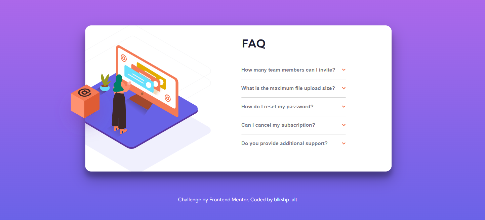

# Frontend Mentor - FAQ accordion card solution

This is a solution to the [FAQ accordion card challenge on Frontend Mentor](https://www.frontendmentor.io/challenges/faq-accordion-card-XlyjD0Oam). Frontend Mentor challenges help you improve your coding skills by building realistic projects. 

## Table of contents

- [Overview](#overview)
  - [The challenge](#the-challenge)
  - [Screenshot](#screenshot)
  - [Links](#links)
- [My process](#my-process)
  - [Built with](#built-with)
  - [What I learned](#what-i-learned)
  - [Continued development](#continued-development)
  - [Useful resources](#useful-resources)
- [Author](#author)
- [Acknowledgments](#acknowledgments)

## Overview

### The challenge

Users should be able to:

- View the optimal layout for the component depending on their device's screen size
- See hover states for all interactive elements on the page
- Hide/Show the answer to a question when the question is clicked

### Screenshot

### Links

- Solution URL: [Solution](https://https://github.com/blkshp-alt/faq-accordian-card.git)
- Live Site URL: [Live URL](https://blkshp-alt-faq-accordian-card.netlify.app/)

## My process

### Built with

- Semantic HTML5 markup
- CSS custom properties
- Flexbox
- CSS Grid
- Mobile-first workflow
- Vanilla Javascript

### Continued development

I need to continue strengthening my skills in all areas of frontend development, but I hope to gain a better understanding of javascript.

### Useful resources

- [Example resource 1 position](https://developer.mozilla.org/en-US/docs/Web/CSS/position) - This helped me understand the parent element needs to be relative and that the child element needs to be absolute to attain the positioning in the mock-up.

- [Example resource 2 translate](https://developer.mozilla.org/en-US/docs/Web/CSS/transform-function/translateX) - This is a great breakdown of how to move horizontally which is very important for this project.

## Author

- Frontend Mentor - [@blkshp-alt](https://www.frontendmentor.io/profile/blkshp-alt)

## Acknowledgments

The image placement for this challenge was tricky for me and required a lot of trial and error. I found YouTube and mdn extremely helpful. 

